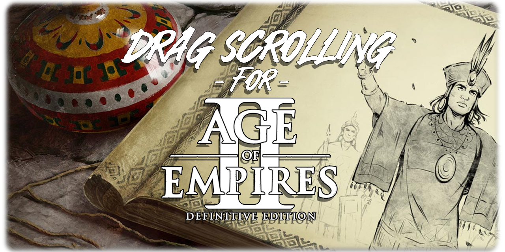

[](../../releases/latest)

# Age of Empires II: Definitive Edition - Drag Scroll


> *TO BE UPDATED TO WORK WITH LATEST UPDATE*

Adds drag scrolling to Age of Empires II: Definitive Edition. Hold middle mouse (or whichever bind you like) and drag to pan the camera, similarly to what you might find in games like StarCraft II.

Fork of [asieradzk's original script](https://github.com/asieradzk/AoE2Mouse_Camera_Drag), which aims to keep this functional throughout all future updates.

---

## Requirements

- [AutoHotkey](https://www.autohotkey.com/) installed
- Run the script as **administrator** to avoid any potential permissions conflicts.

---

## How to use

1. Download `AoE2DE-Drag-Scroll.ahk` from the [latest release](../../releases/latest)
2. Right-click it and hit **Run as administrator**
3. Load into a game
4. Hold middle mouse (default key) and drag to pan

To stop the script, right-click the AutoHotkey icon in your taskbar and hit Exit.
To reload after making changes, press **Ctrl+Alt+R** while the script is running.

---

## Rebinding the key

Open the script in any text editor and change this line near the top:

```
PanKey := "MButton"
```

Some examples:
- `"RButton"` — right mouse button
- `"XButton1"` — mouse side button 1
- `"XButton2"` — mouse side button 2

Save the file and reload with Ctrl+Alt+R.

---

## If it breaks after a game update

Game updates shift the memory addresses the script relies on. See [UPDATING-OFFSETS.md](UPDATING-OFFSETS.md) for a full guide on how to find and update them.

---

## Troubleshooting

**Camera doesn't move at all**
Make sure you're running the script as administrator. If you are, the offsets are probably outdated — see [UPDATING-OFFSETS.md](UPDATING-OFFSETS.md).

**Middle click stopped working**
The script passes through a normal middle click if you didn't drag. If this isn't working, try reloading with Ctrl+Alt+R.

---

## License

MIT — same as the original. Do whatever you want with it.
